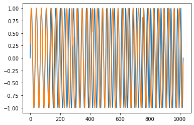
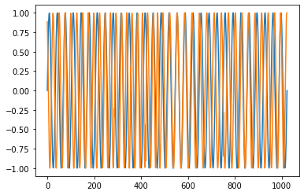
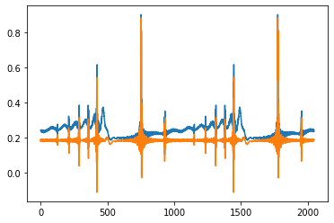

# Blaschke-Decomposition-Python
> Blaschke decomposition based on python (non-numerical analytical solver)
## Blaschke-Decomposition(Python)
---
> **The Matlab version of the program is derived from [Hau-Tieng Wu](https://github.com/hautiengwu/BlaschkeDecomposition) **
---
Contribution of this project:
[1] Blaschke decomposition based on python (non-numerical analytical solver).
[2] Partial implementation of BKD decomposition based on added carriers.
[3] Python version of instantaneous phase implementation for time-frequency analysis
---
### Applications

Modal extraction of non-stationary signals is achieved by BKD for applications such as WVD to remove cross-terms and for higher quality signal analysis needs.

 
 
A demonstration program for time-frequency analysis based on instantaneous phase is also provided.
 
---
### **Warning**

The program notes are in non-English and contain some of Spyder's operating tips.
------
Author: Green_yuan

This program is free software: you can redistribute it and/or modify
it under the terms of the GNU General Public License as
published by the Free Software Foundation, either version 3 of the
License, or (at your option) any later version.
